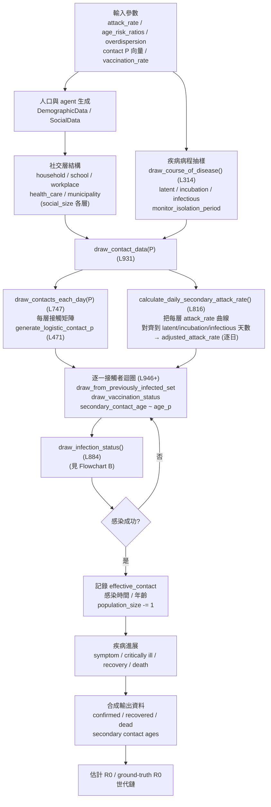
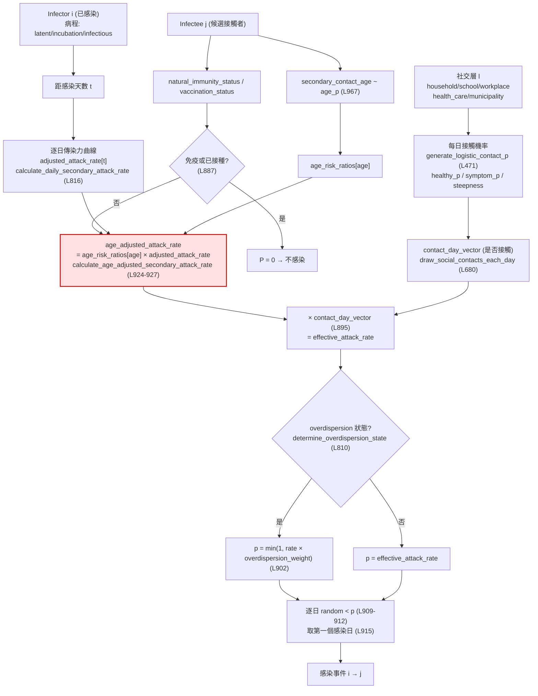

# CovSyn 機率鏈流程圖 (Flowcharts)

> 以下兩張 Mermaid 流程圖直接對應 `Data_synthesize.py` 的實際程式碼路徑，
> 並標出可疑節點（risk ratio 當成乘數的問題）。

---

## Flowchart A — CovSyn 完整參數→輸出工作流程



---

## Flowchart B — Infector → Infectee 機率鏈



---

## 圖中標紅節點（S1）= 核心疑慮

`calculate_age_adjusted_secondary_attack_rate` (L924-927) 做的是：

```python
age_adjusted_attack_rate = self.age_risk_ratios[secondary_contact_age] * adjusted_attack_rate
```

- ✅ **正確的部分**：risk ratio 是套在 **infectee（secondary_contact_age）** 的年齡上，符合「次級臨床侵襲率風險比應對應被感染者年齡」的預期。
- ⚠️ **疑慮部分**：`age_risk_ratios` 被當成一個**獨立乘數 (input weight)** 直接乘進機率鏈。
  若文獻中的 age risk ratio 本身是「整條機率鏈的最終 emergent 結果」，那麼在這裡再乘一次就會造成
  **重複計入 / 機率定義衝突** —— 應該是驗證目標 (validation target)，而非鏈內乘數。
