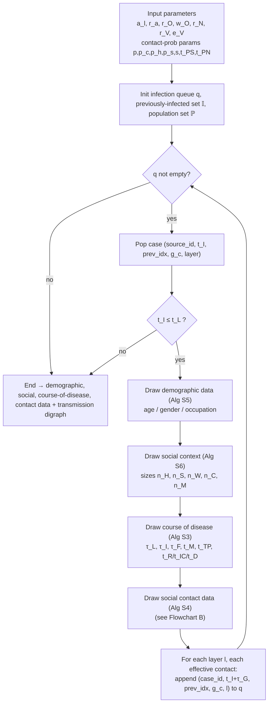
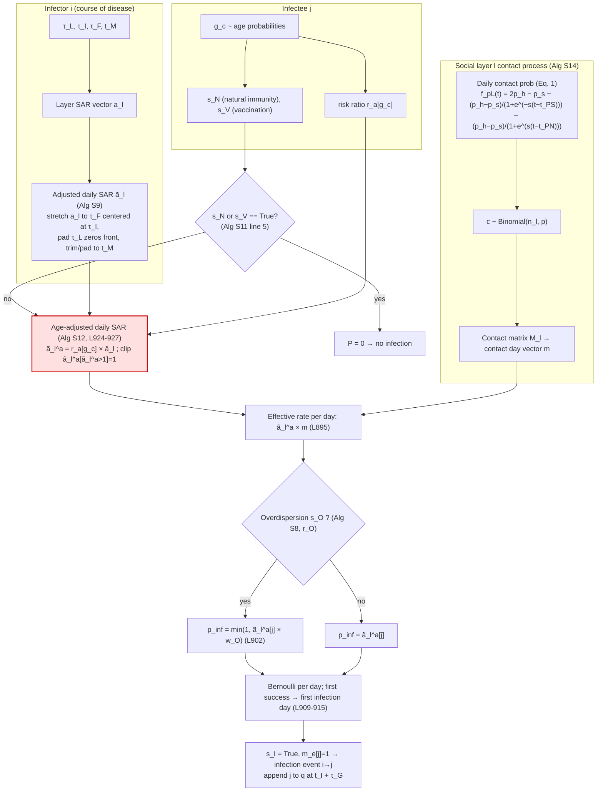

# CovSyn Probability-Chain Flowcharts (English, with paper notation)

> Symbols follow the Supplementary **Table S1** notation list, and the node logic follows
> Algorithms **S2** (main loop), **S9** (adjusted daily SAR), **S11** (draw infection status),
> **S12** (age-adjusted SAR), **S13/S14** (contacts each day), and Eq. (1) (contact-probability function).
> Code anchors point to `Data_synthesize.py`.

## Notation quick key

| Symbol | Meaning | Symbol | Meaning |
|---|---|---|---|
| `q` | infection queue | `t_I` | time of infection |
| `t_L` | simulation time limit | `t_M` | time of monitored isolation |
| `τ_L / τ_I / τ_F` | latent / incubation / infectious period | `τ_G` | generation time |
| `n_H,n_S,n_W,n_C,n_M` | layer sizes (household/school/workplace/clinic/municipality) | `M` | contact matrix (all layers) |
| `a_l` | daily secondary attack rate (SAR) vector, layer `l` | `ã_l` | adjusted daily SAR vector |
| `ã_l^a` | age-adjusted daily SAR vector | `m` | contact day vector |
| `m_e` | effective contact day vector | `c` | number of contacts |
| `r_a[g_c]` | age risk ratio at secondary-contact age `g_c` | `g_c` | age of secondary contact |
| `s_N / s_V / s_O` | natural-immunity / vaccination / overdispersion state | `r_O / w_O` | overdispersion rate / weight |
| `f_pL` | contact-probability function (Eq. 1) | `p_h,p_s,s,t_PS,t_PN` | its parameters |

---

## Flowchart A — Full CovSyn parameter→output workflow (Algorithm S2)



Code: main loop in [Data_synthesis_main.py](Data_synthesis_main.py); contact stage `draw_contact_data` [Data_synthesize.py:931](Data_synthesize.py#L931).

---

## Flowchart B — Infector → Infectee probability chain (Algorithms S4/S9/S11/S12)



Code anchors: `calculate_daily_secondary_attack_rate` [Data_synthesize.py:816](Data_synthesize.py#L816);
`draw_infection_status` [Data_synthesize.py:884](Data_synthesize.py#L884);
`calculate_age_adjusted_secondary_attack_rate` [Data_synthesize.py:924](Data_synthesize.py#L924).

---

## The highlighted node S1 = the core concern

Algorithm **S12** / code [Data_synthesize.py:924-927](Data_synthesize.py#L924-L927):

```text
ã_l^a = ã_l × r_a[g_c]          (then clip values > 1 to 1)
```

- ✅ **Correct:** `r_a` is indexed by the **infectee's** age `g_c` (the secondary contact), matching the
  intended meaning "age-related secondary clinical attack-rate risk ratio refers to the infectee's age."
  In the code `g_c` is drawn from the age distribution at [Data_synthesize.py:967](Data_synthesize.py#L967) — no infector/infectee swap bug.
- ⚠️ **Concern:** `r_a` enters as an **independent multiplier inside** the probability chain. The
  trained values (Table S3: `r_a(0-19)=0.03`, `r_a(20-39)=0.14`, `r_a(40-59)=0.93`, `r_a(60+)=0.47`)
  scale the per-day SAR directly. If the literature age risk ratio is meant to be the **emergent cumulative
  result** of the whole chain (Eq. 7, ρ = x/n) rather than an input weight, multiplying here risks
  double-counting / a definitional conflict. It should arguably be a **validation target**, not a chain multiplier.

This is exactly the question Sections 3–4 of the audit prompt ask about.
```
