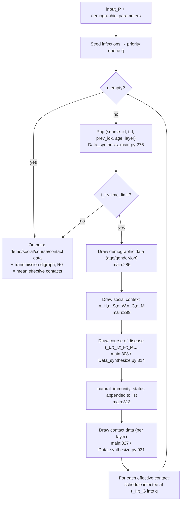
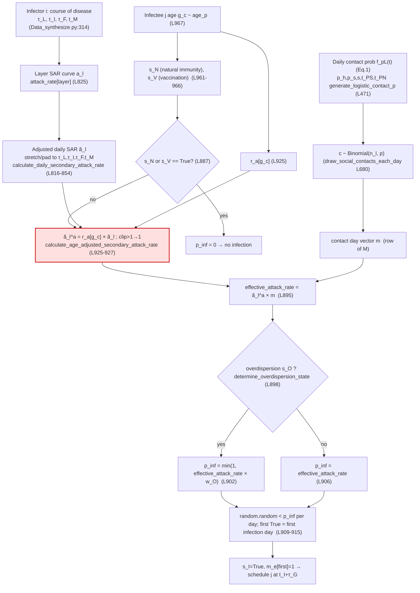

# CovSyn Parameter Calculation Audit

> Scope: how each major parameter flows from input → function → equation → intermediate variable →
> infection event and final output. Code anchors use `file:line`. Trained values are taken from the
> Supplementary (Tables S2–S9) and `firefly_best_NEW.txt`; the age-risk-ratio analysis is consistent
> with the companion note [covsyn_risk_ratio_issues.md](covsyn_risk_ratio_issues.md).
>
> Evidence tags used throughout: **[C]** confirmed from code, **[I]** inferred from code,
> **[?]** unclear / requires verification.

---

## 1. Executive summary

- **How infections are generated [C].** The simulator runs an agent queue (`Data_synthesis_main.py:274`).
  For each infected source case it draws demographics, a social context (five layer sizes), a course of
  disease (timing), then a *contact matrix*. For every contact it draws an infectee age, immunity, and
  overdispersion state, computes a per-day infection probability, and does a Bernoulli draw. The first
  successful day becomes an *effective contact*; that infectee is scheduled back into the queue at
  `t_I + τ_G` (generation time).
- **Parameters that drive contact generation [C]:** layer sizes `n_H,n_S,n_W,n_C,n_M`; contact-probability
  parameters `p, p_c, p_h, p_s, s, t_PS, t_PN` via the logistic function `f_pL` (Eq. 1).
- **Parameters that drive transmission probability [C]:** layer daily secondary-attack-rate vectors
  `a_l`; the age risk ratio `r_a[g_c]`; overdispersion `r_O, w_O`; immunity/vaccination states `s_N, s_V`.
- **Parameters that drive disease timing [C]:** gamma parameters for `τ_L, τ_I, τ_F`, time-to-isolation,
  recovery, ICU, death; plus transition probabilities `p_IAR, p_ISR, p_ICR`.
- **Outputs / validation targets [C/I]:** secondary attack rate by layer and by day, R0 (mean effective
  contacts), confirmed/recovered/dead series, transition-time distributions.
- **Most suspicious usage [C]:** the **age risk ratio `r_a` is applied as a direct multiplier inside the
  infection-probability chain** (`Data_synthesize.py:925`) *without population-weighted normalization*,
  while it is simultaneously a literature quantity (Cheng et al.) and a free Firefly parameter with no
  age-stratified cost term. This is a probable double-role / double-counting problem (Sections 5.4, 8).

---

## 2. Full CovSyn workflow

```text
input parameters (input_P, demographic_parameters)
→ seed infections placed in priority queue
→ pop case (source_id, t_I, prev_idx, age, layer)
→ demographic generation (age/gender/occupation)
→ social context generation (n_H,n_S,n_W,n_C,n_M)
→ disease-course generation (τ_L,τ_I,τ_F,t_M,t_TP,t_R/t_IC/t_D)
→ contact generation (logistic f_pL → contact matrix M per layer)
→ transmission decision (adjusted SAR × age RR × overdispersion → Bernoulli)
→ new infections scheduled at t_I + τ_G
→ outputs: demographic/social/course/contact data + transmission digraph
```



Confirmed anchors: queue loop `Data_synthesis_main.py:274-334`; contact stage `draw_contact_data`
`Data_synthesize.py:931`.

---

## 3. Infector-to-infectee probability chain



**Variables and equations at each step (all [C] unless noted):**

| Step | Code variable | Operation | Location |
|---|---|---|---|
| Layer SAR curve | `attack_rate[layer]` (`a_l`) | lookup | `Data_synthesize.py:825` |
| Adjust to case timing | `adjusted_attack_rate` (`ã_l`) | stretch to `τ_F` centered at `τ_I`, pad `τ_L` zeros, trim/pad to `t_M` | `816-854` |
| Daily contact prob | `daily_p` via `generate_logistic_contact_p` | Eq. 1 | `471-482`, `680-746` |
| Candidate contacts | `c` | `Binomial(n_l, p)` | `draw_social_contacts_each_day` |
| Contact day vector | `m` (matrix row) | first-contact matrix + consecutive draws | `567-746` |
| Infectee age | `secondary_contact_age` (`g_c`) | `random.choices(arange(101), weights=age_p)` | `967` |
| Age adjust | `age_adjusted_attack_rate` (`ã_l^a`) | `r_a[g_c] × ã_l`, clip>1→1 | `925-927` |
| Apply contacts | `effective_attack_rate` | `ã_l^a × m` | `895` |
| Overdispersion | `overdispersion_p` | `min(1, eff × w_O)` if `s_O` | `900-906` |
| Bernoulli | `infection_days` | `random < p_inf`, take first | `909-915` |
| Schedule | `effective_contacts_vector` (`m_e`), `t_I+τ_G` | append to queue | `917-920` + main loop |

---

## 4. Parameter-by-parameter calculation table

| Parameter | Meaning | Code location | Used in function | Calculation role | Intermediate affected | Final output affected | Type |
|---|---|---|---|---|---|---|---|
| `a_l` (`attack_rate[layer]`) | layer daily SAR curve (−14..+10 d) | `Data_synthesize.py:825` | `calculate_daily_secondary_attack_rate` | base transmission rate | `adjusted_attack_rate` | infection events, layer SAR | fitted parameter |
| `ã_l` (`adjusted_attack_rate`) | SAR stretched to this case's timing | `816-854` | same | timing-aligned SAR | `effective_attack_rate` | infection timing | derived intermediate |
| `ã_l^a` (`age_adjusted_attack_rate`) | age-scaled daily SAR | `924-927` | `calculate_age_adjusted_secondary_attack_rate` | per-day infection prob | `effective_attack_rate` | who gets infected by age | derived intermediate |
| `r_a` (`age_risk_ratios`) | 4 age-group risk ratios → per-age | main:127-128; `925` | age adjust | **direct multiplier** | `ã_l^a` | age distribution of infections | **suspicious** (input × fitted × target) |
| `r_a[g_c]` | risk ratio at infectee age | `925` | age adjust | scalar multiplier | `ã_l^a` | infection prob | suspicious |
| `g_c` (`secondary_contact_age`) | infectee age | `967,1013,1057,1101,1145` | `draw_contact_data` | index into `r_a` | `ã_l^a` | recorded contact age | state variable |
| `n_H..n_M` | layer sizes | `draw_social_data` | `draw_social_contacts_each_day` | Binomial n | `c` | #contacts | input (from data) |
| `M` (`*_contacts_matrix`) | contact matrix per layer | `747-791` | `draw_contacts_each_day` | which days contact | `m` | contact network | derived intermediate |
| `m` (matrix row) | contact day vector | `951+` | `draw_infection_status` | masks SAR | `effective_attack_rate` | infection day | derived intermediate |
| `m_e` (`effective_contacts_vector`) | effective contact day | `917-919` | `draw_infection_status` | flags infection day | — | effective contacts, R0 | output |
| `c` (`contacts_number`) | #contacts drawn | `draw_social_contacts_each_day` | same | matrix rows | `M` | close-contact counts | derived intermediate |
| `p` (`contact_p`) | per-layer contact prob | `750+` (P[0],P[7],...) | `draw_social_contacts_each_day` | Binomial p | `c` | #contacts | fitted parameter |
| `p_c` (`contact_previous_day_p`) | consecutive-day contact prob | `750+` | `draw_social_contacts_each_day` | repeat-contact prob | `M` | contact pattern | fitted parameter |
| `p_h` (`healthy_p`) | contact prob when healthy | `750+` | `generate_logistic_contact_p` | Eq.1 baseline | `daily_p` | contact timing | fitted parameter |
| `p_s` (`symptom_p`) | contact prob when symptomatic | `750+` | `generate_logistic_contact_p` | Eq.1 dip | `daily_p` | contact timing | fitted parameter |
| `s` (`steepness`) | logistic steepness | `752+` | `generate_logistic_contact_p` | Eq.1 slope | `daily_p` | contact timing | fitted parameter |
| `t_PS` (`symptom_phase`) | onset phase | `752+` | `generate_logistic_contact_p` | Eq.1 shift | `daily_p` | contact timing | fitted parameter |
| `t_PN` (`recover_phase`/width) | back-to-normal phase | `752+` | `generate_logistic_contact_p` | Eq.1 shift | `daily_p` | contact timing | fitted parameter |
| `f_pL` | contact-prob function | `471-482` | `generate_logistic_contact_p` | Eq.1 | `daily_p` | contact timing | equation |
| `τ_L` (`latent_period`) | latent period | `210-214` | `draw_course_of_disease` | infectious start | `ã_l` padding | when infectious | fitted (gamma) |
| `τ_I` (`incubation_period`) | incubation | `225-232` | `draw_course_of_disease` | symptom onset / SAR center | `ã_l` center | onset, SAR shape | fitted (gamma) |
| `τ_F` (`infectious_period`) | infectious period | `216-223` | `draw_course_of_disease` | infectious length | `ã_l` length | infectious window | fitted (gamma) |
| `τ_G` (generation time) | infector→infectee gap | main loop (`t_I+τ_G`) | queue scheduling | next infection day | queue | epidemic speed | derived intermediate/output |
| `t_I` (`infection_day`) | time of infection | main:276 | all | timeline origin | all dates | all dated outputs | state variable |
| `t_M` (`monitor_isolation_period`) | isolation time | `234-241` | `draw_course_of_disease` | end of contact window | `ã_l` trim, M width | isolation/confirm date | derived intermediate |
| `t_L` (`time_limit`) | sim horizon | main:278 | main loop | stop condition | — | run length | input parameter |
| `r_N` (`natural_immunity_rate`) | natural immunity prob | `308-312` | `draw_natural_immunity_status` | sets `s_N` | `s_N` | reinfection block | input/fitted |
| `s_N` (`natural_immunity_status`) | immunity state (infectee) | `961,1006,...` | `draw_infection_status` | p_inf→0 if True | `infection_status` | reinfection | state variable |
| `r_V` (`vaccination_rate`) | vax prob | `804-808` | `draw_vaccination_status` | sets `s_V` | `s_V` | infection block | input/fitted |
| `e_V` (`vaccine_efficacy`) | vaccine efficacy | `462` (stored) | — | **stored but unused in `draw_vaccination_status`** | — | none in trained run | suspicious (see 5.5) |
| `s_V` (`vaccination_status`) | vax state (infectee) | `966,1012,...` | `draw_infection_status` | p_inf→0 if True | `infection_status` | infection block | state variable |
| `r_O` (`overdispersion_rate`) | prob of overdispersed source | `810-814` | `determine_overdispersion_state` | sets `s_O` | `s_O` | clustering | fitted parameter |
| `w_O` (`overdispersion_weight`) | multiplier when `s_O` | `902-903` | `draw_infection_status` | `min(1, eff×w_O)` | `infection_probs` | clustering, totals | fitted parameter |
| `s_O` (`overdispersion_state`) | per-contact overdispersion | `898` | `draw_infection_status` | gate on `w_O` | `infection_probs` | clustering | state variable |
| `attack_rate` | dict of layer SAR vectors | main `input_P` slice → `Draw_contact_data` | `calculate_daily_secondary_attack_rate` | base transmission | `ã_l` | infections | fitted parameter / **also validation target** |
| `age_risk_ratios` | see `r_a` | `935-940` init | — | multiplier | `ã_l^a` | age of infections | suspicious |
| `effective_attack_rate` | `ã_l^a × m` | `895` | `draw_infection_status` | per-day p | `infection_probs` | infection day | derived intermediate |
| `infection_status` (`s_I`) | infected? | `884-922` | `draw_infection_status` | Bernoulli result | queue | new infections | output |
| `effective_contacts_vector` (`m_e`) | effective contact day | `917-919` | `draw_infection_status` | flag | — | R0, effective contacts | output |

---

## 5. Detailed explanation of major parameter groups

### 5.1 Disease timing parameters

All timing draws live in `Draw_course_of_disease_data` (`Data_synthesize.py:143-451`) and are sampled
from gamma distributions (some truncated, `truncated_gamma_sample` L195). The accepted set must satisfy
`τ_L ≤ t_M ≤ τ_L + τ_F` (rejection loop, `326-332`). **[C]**

```text
latent period τ_L      → draw_latent_period (L210)      → when the case becomes infectious (ã_l leading zeros, L843-844)
incubation τ_I         → draw_incubation_period (L225)  → symptom onset; the SAR "center" (L833) & contact-prob phase (Eq.1)
infectious period τ_F  → draw_infectious_period (L216)  → length of the SAR window (L828/834)
time to isolation t_M  → draw_time_from_infection_to_monitored_isolation (L234) → end of contact window; SAR trimmed to t_M (L845-849)
time to recovery t_R   → draw_time_from_*_to_recovered   → recovered-set membership; reinfection eligibility
time to ICU t_IC       → draw_time_from_symptomatic_to_critically_ill_new (L272) → critically-ill output
time to death t_D      → draw_time_from_infection_to_death (L302) → death output
generation time τ_G    → infection scheduled at t_I+τ_G (main loop) → epidemic speed
```

Effect map for each timing parameter:

- **Becomes infectious:** after `τ_L` (SAR vector has `τ_L` leading zeros, L843-844). **[C]**
- **How long they can infect:** `τ_F` (SAR window length). **[C]**
- **When isolated:** `t_M` (SAR/contact matrix truncated at `t_M`, L845-849). **[C]**
- **When confirmed:** `t_M + N(0,0.3)` positive test (`draw_date_of_positive_test`, L243). **[C]**
- **Recover/die:** chosen by transition probabilities `p_IAR/p_ISR/p_ICR` then timed (L350-451). **[C]**
- **When secondary infections are scheduled:** infectee enters queue at `t_I + τ_G` (main loop). **[C]**

### 5.2 Social-layer and contact parameters

Five layers each have an independent 7-tuple in `P` consumed by `draw_contacts_each_day` (L747-791):
`[contact_p, contact_previous_day_p, healthy_p, symptom_p, steepness, symptom_phase, recover_phase]`
(household `P[0:7]`, school `P[7:14]`, workplace `P[14:21]`, healthcare `P[21:28]`, municipality `P[28:35]`). **[C]**

| Layer | #possible contacts | contact on a given day | transmission after contact |
|---|---|---|---|
| Household | `Binomial(n_H, p_H)` | `f_pL` with `p_hH,p_sH,s_H,t_PSH,t_PNH` | `a_H` curve × `r_a[g_c]` × `w_O` |
| School | `Binomial(n_S, p_S)` | `f_pL` (school params) | `a_S` × `r_a[g_c]` × `w_O` |
| Workplace | `Binomial(n_W, p_W)` | `f_pL` (workplace params) | `a_W` × `r_a[g_c]` × `w_O` |
| Healthcare | `Binomial(n_C, p_C)` | `f_pL` (healthcare params; rises after onset) | `a_C` × `r_a[g_c]` × `w_O` |
| Municipality | `Binomial(n_M, p_M)` | `f_pL` (municipality params) | `a_M` × `r_a[g_c]` × `w_O` |

Contact-probability function (Eq. 1, `generate_logistic_contact_p`, L471-482):

```text
f_pL(t) = 2·p_h − p_s − (p_h−p_s)/(1+e^(−s(t−t_PS))) − (p_h−p_s)/(1+e^(s(t−t_PN)))
```

with `t` measured relative to symptom onset `τ_I`. **[C]**

### 5.3 Secondary attack rate parameters

1. **Is SAR an input to infection probability?** Yes. `a_l` (layer SAR) → `ã_l` → per-day infection
   probability. **[C]**
2. **Is SAR also a validation target?** Yes — the Firefly cost function fits simulated SAR-by-day-bin to
   Cheng et al. (Supplementary §X.B; `firefly_optimizer.py`). So SAR is simultaneously an input and a
   calibration target. **[C/I]**
3. **Both layer SAR and age risk ratio used?** Yes: `ã_l^a = r_a[g_c] × ã_l`. **[C]**
4. **Double-counting risk?** Yes, potentially — see Sections 5.4 and 8. The layer SAR `a_l` is calibrated
   on Cheng's **all-ages** setting-level data, and `r_a` then rescales it by age without renormalization,
   so the population-mean SAR is shifted by `Z = Σ p_age·r_a[age]`. **[C]** (matches
   [covsyn_risk_ratio_issues.md](covsyn_risk_ratio_issues.md) Problem 1).

### 5.4 Age risk ratio parameters — primary concern

Confirmed facts **[C]**:

1. **Indexed by infector or infectee?** **Infectee.** `r_a` is indexed by `secondary_contact_age`
   (`g_c`), the contact's age, at `Data_synthesize.py:925`. This is epidemiologically the intended target
   (the *infectee*). No infector/infectee swap bug.
2. **Where is `g_c` generated?** `secondary_contact_age = random.choices(np.arange(101), weights=self.age_p)`
   at `Data_synthesize.py:967` (and 1013/1057/1101/1145 for the other layers) — sampled from the **global**
   population age distribution `age_p`, identical across all five layers.
3. **Where is `r_a[g_c]` applied?** `calculate_age_adjusted_secondary_attack_rate`, `Data_synthesize.py:924-927`.
4. **Is the equation `age_adjusted_SAR = SAR × age_risk_ratio`?** Yes, exactly:

   ```python
   age_adjusted_attack_rate = self.age_risk_ratios[secondary_contact_age] * adjusted_attack_rate
   age_adjusted_attack_rate[age_adjusted_attack_rate > 1] = 1
   ```

5. **Does this treat the literature age risk ratio as a direct input multiplier?** Yes. **[C]**
6. **Logically consistent?** Partially. Cheng's `r_a` is a *relative* ratio with the **20–39 group as
   reference** (`r_a(20-39) ≡ 1`). Multiplying it onto an **all-ages average** SAR `ā` (not the reference
   group's SAR) without dividing by the population-weighted mean `Z = Σ p_age·r_a[age]` shifts the overall
   SAR level by `Z` and breaks the "relative-to-20–39" meaning. **[C/I]**
7. **Input multiplier, fitted parameter, or validation target?** Currently it is **all three at once**:
   initial value = Cheng `[0.3, 1, 2.19, 1.75]` (`parameters_for_initialization.py:935`), bounds = Cheng
   95% CI, and it is a free Firefly parameter (`input_P[63:67]`). With no age-stratified cost term, the
   optimizer drifts it to `[0.026, 0.138, 0.927, 0.469]` (Table S3 / `firefly_best_NEW.txt`) — all < 1 and
   directionally opposite to Cheng (60+ should be 1.75, became 0.47). **[C]** Recommended role:
   **validation target**, or a **fixed** literature input with normalization (Section 9).
8. **Could it conflict with other probabilities?** Yes — it multiplies the same per-day SAR that the layer
   cost already calibrates, and it is then further multiplied by `w_O`. Three multipliers (`ã_l`, `r_a`,
   `w_O`) act on the same probability with overlapping calibration responsibility (Section 8).
9. **Alternatives:** (A) fix `r_a` to Cheng values and add `/Z` normalization; (B) treat `r_a` as a
   validation target computed from outputs; (C) define latent susceptibility parameters fit to reproduce
   the literature ratios (Section 9).

### 5.5 Immunity and vaccination parameters

1. **Generated for infector or infectee?** **Infectee.** Natural immunity is read from
   `natural_immunity_status_list[case_id-1]` for a previously-infected contact (`Data_synthesize.py:961`),
   else `False` for a fresh population contact. Vaccination is drawn per contact via
   `draw_vaccination_status` (L966). **[C]**
2. **Reduce probability or set to zero?** **Set to zero.** `draw_infection_status` early-returns
   `False` if `s_N or s_V` (L887) → `p_inf = 0`. **[C]**
3. **Before or after contact generation?** After — checked per contact inside the infection draw. **[C]**
4. **Effect on final events:** with trained `r_N ≈ 0.93`, ~93% of *recovered* contacts are immune to
   reinfection; with trained `r_V = 0`, vaccination never triggers. **[C]**
5. **Inconsistency [C]:** `draw_vaccination_status` (L804-808) uses **only** `vaccination_rate`, not
   `vaccination_rate × vaccine_efficacy` as in Supplementary Algorithm S7. `vaccine_efficacy` is stored
   (L462) but not used in the draw. Because `r_V = 0` in the trained model this is currently inert, but it
   is a code/paper mismatch worth flagging. **[?]** verify there is no other consumer of `vaccine_efficacy`.

### 5.6 Overdispersion parameters

1. **When sampled?** Inside `draw_infection_status` (L898), once per call. **[C]**
2. **Granularity?** **Per contact** (the function is called once per contact row), and the single state is
   applied to all of that contact's days. Not per-day, not per-person-source. **[C]**
3. **How `w_O` modifies probability?** `overdispersion_p = np.minimum(1, effective_attack_rate * w_O)`
   (L902-903). **[C]**
4. **Equation `p_inf = min(1, base × w_O)`?** Yes. **[C]**
5. **Effect of larger `w_O`?** Increases per-event infection probability **for overdispersed contacts
   only** (fraction `r_O`), so it raises both totals and clustering/heterogeneity. **[I]**
6. **Clipping at 1?** Yes, `np.minimum(1, …)`. **[C]**
7. **Problematic interaction?** It multiplies a probability that **already** includes `ã_l` (calibrated)
   and `r_a` (age). So `w_O` overlaps with the SAR/age calibration; and the clip-at-1 makes the chain
   non-linear at the top end (Section 8). **[C/I]**

---

## 6. Current-model equations (with code variable names)

```text
# contact generation (per layer l), t relative to symptom onset τ_I
daily_p_l(t) = f_pL(t) = 2·p_h − p_s − (p_h−p_s)/(1+e^(−s(t−t_PS))) − (p_h−p_s)/(1+e^(s(t−t_PN)))   [asymptomatic: daily_p_l = p_h]
c_l          ~ Binomial(n_l, p_l)
M_l          = first_contact_matrix(...) then consecutive draws with p_c     # rows = contacts, cols = days
m            = M_l[row, :]                                                    # contact day vector ∈ {0,1}

# transmission rate alignment to this case's timing
ã_l          = adjust(a_l, τ_L, τ_I, τ_F, t_M)                               # calculate_daily_secondary_attack_rate (L816)
ã_l^a        = min(1, r_a[g_c] · ã_l)                                        # L925-927   ← age multiplier, NO /Z

# per-day infection probability
effective    = ã_l^a · m                                                     # L895

if s_N or s_V:           p_inf = 0                                            # L887  (infectee immune/vaccinated)
elif s_O:                p_inf = min(1, effective · w_O)                      # L902
else:                    p_inf = effective                                   # L906

infection_day = first day with random() < p_inf                              # L909-915
s_I           = (such a day exists)
if s_I: schedule infectee into queue at t_I + τ_G                            # main loop
```

Difference from the prompt's example: the immunity/vaccination check is on the **infectee**, overdispersion
is **per contact**, and the age multiplier has **no `Z` normalization**. **[C]**

---

## 7. Input vs output vs validation-target audit

| Category | Variables | Explanation |
|---|---|---|
| Direct input parameters | `n_H..n_M` (from demographic data), `t_L`, `age_p` | fixed structural inputs |
| Fitted parameters (Firefly) | `a_l`, `p,p_c,p_h,p_s,s,t_PS,t_PN` (×5 layers), `r_O`, `w_O`, gamma params for `τ_L,τ_I,τ_F,...`, `p_IAR,p_ISR,p_ICR`, **`r_a`** | optimized to minimize cost |
| State variables | `s_N`, `s_V`, `s_O`, `g_c`, `t_I` | drawn per case/contact |
| Intermediate results | `ã_l`, `ã_l^a`, `m`, `c`, `M`, `effective_attack_rate`, `p_inf` | computed |
| Final outputs | `s_I`, `m_e`, confirmed/recovered/dead dates, transmission digraph, R0 | recorded |
| Literature validation targets | layer SAR by day, age-specific SAR/risk ratio, transition-time means, generation time, R0 | compared to literature in Supplementary |
| Suspicious / possibly misclassified | **`r_a`** (input × fitted × target simultaneously), **`a_l`** (input and target), `e_V` (stored, unused) | see §8 |

**Consequence of using a validation target as a direct input multiplier:** the quantity can no longer be
used as an independent check — the model can "reproduce" it trivially because it was injected as an input,
and the optimizer can trade it off against other inputs (degeneracy), as observed with `r_a` drifting to
`[0.026, 0.138, 0.927, 0.469]`. **[C/I]**

---

## 8. Conflict and double-counting analysis

**Conflict 1 — `r_a` as direct multiplier and as a literature/age target.**
- *Duplicated:* the age effect on SAR is both injected (`× r_a[g_c]`) and expected to emerge for validation.
- *Where:* `Data_synthesize.py:925`; cost in `firefly_optimizer.py` (no age-stratified term).
- *Why a problem:* breaks the "relative-to-20–39" meaning; shifts population SAR by `Z`; optimizer drifts
  it directionally wrong.
- *Severity:* **High** (affects who gets infected by age and the overall SAR level).
- *Test:* compute simulated age-specific SAR from outputs and compare to Cheng; vary `r_a` and watch
  population SAR move by `≈Z`.
- *Fix:* fix `r_a` to Cheng values **and** divide by `Z = Σ p_age·r_a[age]` (Section 9, Option A), or make
  it a validation target (Option B).

**Conflict 2 — layer SAR `a_l` vs layer contact probabilities.**
- *Duplicated:* both `a_l` and `p_*`/`f_pL` shape the realized infections per layer/day.
- *Where:* `816-854` (SAR) and `471-746` (contact prob).
- *Why a problem:* contact-timing and transmission-rate are partly interchangeable in fitting → degeneracy.
- *Severity:* **Medium** (model still fits, but parameters are not uniquely identified).
- *Test:* identifiability/sensitivity scan; check Firefly multi-modality (Supplementary Fig. S2 already
  shows multiple local minima).
- *Fix:* fix one family from external data (e.g., contact probabilities from contact surveys) and fit only
  the other.

**Conflict 3 — overdispersion multiplies an already age/SAR-adjusted, soon-to-be-clipped probability.**
- *Duplicated:* `w_O` scales `effective_attack_rate` that already contains `ã_l` (calibrated) and `r_a`.
- *Where:* `902-903`.
- *Why a problem:* `w_O` partly re-does the SAR level; clip-at-1 adds nonlinearity that interacts with high
  `r_a × a_l`.
- *Severity:* **Medium**.
- *Test:* compare infection totals with `s_O` forced off/on; check how often the clip triggers.
- *Fix:* define overdispersion as a mean-preserving heterogeneity (e.g., gamma-distributed multiplier with
  mean 1) instead of a one-sided weight.

**Conflict 4 — transition times affect both the contact window and disease-output targets.**
- *Duplicated:* `τ_I, τ_F, t_M` set the contact/SAR window **and** are validation targets (incubation/
  infectious period distributions, Fig. S1).
- *Where:* `816-854`, `680-746`, and timing draws `210-451`.
- *Why a problem:* fitting contact behavior can distort the timing distributions (Supplementary notes the
  infectious-period overestimate). 
- *Severity:* **Low–Medium**.
- *Test:* compare simulated `τ_F` to literature (already done, Table S11 shows 21.8 vs 3.5–20).
- *Fix:* separate asymptomatic infectious-period handling; constrain timing draws independently of contact
  fitting.

**Conflict 5 — `attack_rate` used as both input and target.** Same as Conflict 1's SAR side; covered above.

---

## 9. Suggested corrected formulation

### Option A — Keep `r_a` as an input multiplier (fixed + normalized)
Assumptions required: `a_l` represents the **all-ages population-mean** SAR, and `r_a` is a fixed relative
ratio. Then normalize so the age adjustment is mean-preserving:

```python
# precompute once: Z = Σ_age p_age · r_a[age]   (per layer if per-layer age distributions are added)
age_adjusted = (r_a[g_c] / Z) * adjusted_attack_rate
age_adjusted[age_adjusted > 1] = 1
```

This keeps Cheng's age structure while leaving the calibrated population-mean SAR unchanged. Also fix
`r_a` to `[0.3, 1, 2.19, 1.75]` (lb = ub) so the reference group stays 1 and the optimizer cannot drift it.
**Validation:** simulated population-mean SAR should match the layer calibration; simulated age-specific
SAR ratios should reproduce Cheng. (This is exactly Option A in [covsyn_risk_ratio_issues.md](covsyn_risk_ratio_issues.md).)

### Option B — Treat `r_a` as a validation target (not a chain input)
Remove the `× r_a` multiplier; instead compute from outputs:

```text
simulated_risk_ratio(age_group) = simulated_SAR(age_group) / simulated_SAR(reference 20-39)
compare:  simulated_risk_ratio(age_group) ≈ literature_risk_ratio(age_group)
```

For the age effect to *emerge*, susceptibility must enter through a mechanism that is itself calibrated
(Option C), otherwise no age gradient appears. **Validation:** the above ratio plot.

### Option C — Latent age-susceptibility parameters fit to reproduce the ratios
Define per-age susceptibility `σ(age)` (latent, not equal to the observed ratio) entering as
`p_inf ∝ σ(g_c) · ã_l`, and add an **age-stratified SAR cost term** (Cheng's age columns: contacts
`281/1161/794/331`, SAR `0/0.5/1.1/0.9 %`) so the optimizer learns `σ` to reproduce the literature ratios.
Keep 20–39 as the reference anchor. **Validation:** simulated age-specific SAR matches Cheng within CI,
and `σ` is identifiable (low posterior/firefly spread).

> Do not simply delete `r_a`: replace it with (A) a fixed+normalized multiplier, or (C) a calibrated latent
> susceptibility, and validate via the age-specific SAR ratio plot.

---

## 10. Plots and diagnostics to generate

| # | Plot | x-axis | y-axis | group/color | Data / code variables | Interpretation | Bug signal |
|---|---|---|---|---|---|---|---|
| 1 | Simulated SAR by age group | age group | SAR % | layer | `secondary_contact_age`, `effective_contacts` | does age gradient match Cheng? | flat or inverted gradient |
| 2 | Literature vs simulated age risk ratio | age group | risk ratio | source | `r_a` vs simulated SAR ratio | injected vs emergent agree? | mismatch / inversion |
| 3 | Candidate contact prob by layer | day since onset | `daily_p` | layer | `generate_logistic_contact_p` | layer behavior plausible? | healthcare not rising |
| 4 | Realized contact prob by layer | day since onset | mean `M` per contact | layer | `*_contacts_matrix` | realized vs candidate gap | implausible shape |
| 5 | Final infection prob by layer | day since onset | `p_inf` | layer | `effective_attack_rate`, `infection_probs` | where infections happen | spikes / clip saturation |
| 6 | Adjusted daily SAR | day since onset | `ã_l` | layer | `adjusted_attack_rate` | timing alignment correct? | window off vs `τ_L/τ_F` |
| 7 | Age-adjusted SAR | day since onset | `ã_l^a` | age group | `age_adjusted_attack_rate` | age scaling effect | mean shifted by `Z` |
| 8 | Overdispersion off vs on | `p_inf` | density | `s_O` | force `s_O` False/True | clustering effect | huge mean shift / many clips |
| 9 | Immunity/vax effect | scenario | #infections | `r_N`,`r_V` | toggle states | sensitivity | no effect when expected |
| 10 | Parameter sensitivity | parameter value | infections / R0 / SAR | parameter | one-at-a-time sweep | identifiability | flat (non-identifiable) or unstable |

Several of these already exist in the repo (`plot_layer_sar.py`, `plot_diagnostics.py`, `plot_validation.py`,
`validate_full.py`) and can be reused/extended.

---

## 11. Final checklist

```markdown
- [x] Verify whether `r_a` is infectee-age indexed.            → YES, indexed by secondary_contact_age (Data_synthesize.py:925)
- [x] Confirm whether `r_a` is used as a direct multiplier.    → YES, ã_l^a = r_a[g_c] × ã_l (L925), no /Z normalization
- [ ] Decide whether `r_a` should be input, fitted latent susceptibility, or validation target.  → recommend Option A or C
- [ ] Add /Z normalization (Z = Σ p_age·r_a[age]) and/or lock r_a to Cheng values; re-run Firefly.
- [ ] Add an age-stratified SAR cost term if r_a must remain learnable (Option B/C).
- [x] Write equations for the full infector-to-infectee probability chain.  → Section 6
- [ ] Generate diagnostic plots comparing simulated vs literature age risk ratios (plots 1, 2, 7).
- [ ] Check whether layer SAR and layer contact probability double-count layer effects (Conflict 2).
- [x] Check whether overdispersion multiplies an already-clipped probability.  → multiplies pre-clip, clipped after (L902); mean-preserving redesign suggested
- [ ] Resolve vaccine_efficacy unused in draw_vaccination_status vs Algorithm S7 (rV×eV).
- [ ] Add per-layer infectee age distributions instead of global age_p (Conflict/Problem 6).
- [x] Document all parameter roles in a parameter-by-parameter table.  → Section 4
```

---

### Confidence summary

- **Confirmed from code [C]:** the entire infection chain (Sections 3, 6), `r_a` indexed by infectee age
  with no normalization (5.4), immunity/vaccination set `p_inf=0` on the infectee (5.5), overdispersion
  per-contact `min(1, eff×w_O)` (5.6), `vaccine_efficacy` unused in the vaccination draw (5.5).
- **Inferred from code [I]:** SAR/`r_a` are also Firefly cost targets; the `Z`-shift magnitude and
  degeneracy reasoning (consistent with the companion note).
- **Unclear / verify [?]:** whether any other module consumes `vaccine_efficacy`; the exact age columns/
  weights used in the Firefly cost (inspect `firefly_optimizer.py:334-431`).
